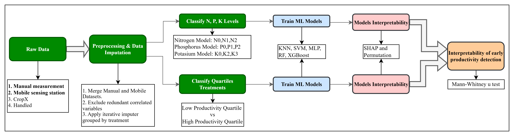
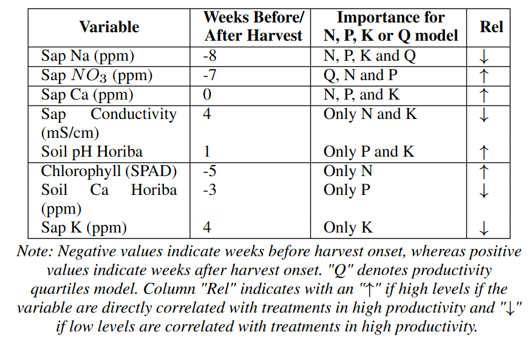
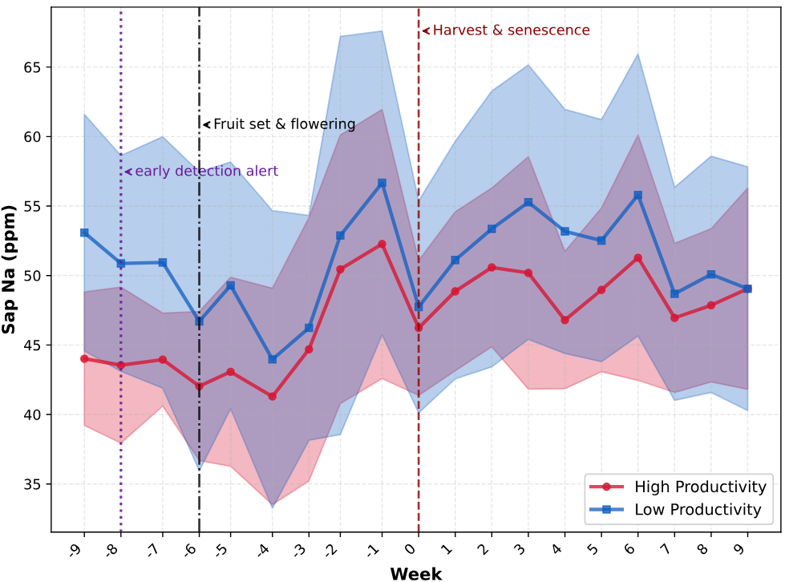

# Tomato Fertilization Classification - Quindío

Machine learning pipeline for classifying optimal NPK fertilizer levels in tomato cultivation using multi-source agricultural data from Quindío, Colombia.

## Project Overview

This project develops classification models to predict optimal nitrogen (N), phosphorus (P), and potassium (K) fertilizer levels based on soil properties, plant health indicators, and environmental conditions. A second model to extract classify the treatments belonging to high and low productivity according to the total weight of harvested fruits. And finally the analysis of the most important variables for these models and that might create an warning according to a significant difference between the treatments in high and low productivity.

**Key Objectives:**
- Classify fertilizer requirements into deficiency/adequate/excess categories
- Classify the treatments belongint to high and low productivity
- Identify most important variables for these models
- Analyze productivity relationships with fertilizer treatments
- Provide interpretable recommendations using SHAP analysis
- Identify warnings alerts finding the week at there's a significant difference between treatments in Q1 and Q4 productivity



## Dataset (`BaseDatos/`)

**Sources:** 

- Fixed stations (CropX, Fijo), mobile sensors (Movil), manual measurements (Manual), and farm management records (Manejo)
- Finally only it's used **Manual measurements and Mobile station measurement.**

**Variables:**
- Soil: VWC, temperature, EC, pH, nutrients (N, P, K, Ca, Na)
- Plant: height, chlorophyll (SPAD), sap nutrients, flowers, fruit metrics
- Environmental: radiation, temperature, humidity
- Productivity: harvested fruits, weight, fruit dimensions

**Preprocessing:**
- Unified data from 2 sources
- Iterative imputation for missing values
- Removed rows with >24 missing values
- Zero-corrected productivity variables before harvest start date

## Notebooks

### Data Preparation
- **1-Explore_data.ipynb**: Initial data exploration and helper functions
- **2-preprocess_unificar.ipynb**: Merge multiple data sources, plant-treatment mapping
- **3-Preprocess_Analizar_Imputar_Datos.ipynb**: Data cleaning, filtering, and iterative imputation
- **3-2-Eliminar_ceros_BD_Imputed.ipynb**: Correct productivity variables to zero before Oct 2, 2024

### Analysis
- **2-Analyze_Time_Series.ipynb**: Treatment distribution, productivity rankings, cumulative productivity trends

### Model Training
- **4_train.ipynb**: Main classification training (8 classes, quartiles, individual NPK)
- **4_train_less_variables.ipynb**: Train with top 70-80% most important features
- **4_train_PCA.ipynb**: Dimensionality reduction experiments

### Results & Interpretation
- **5-Permutation_Importance.ipynb**: Calculate permutation-based feature importance
- **5-Plot-SHAP-Bar.ipynb**: Generate SHAP bar plots for feature importance
- **5-Results-SHAP_Analysis_Ranking.ipynb**: Comprehensive SHAP analysis and variable ranking
- **6-Results-Productivity-Analysis.ipynb**: Correlation analysis between important variables and productivity

## Training Scripts (`train/` and `train_iterations/`)

Final version use scripts in `train_iteraions/`

**Configuration:**
- `config.py`: Model hyperparameters, paths, global settings
- `utils.py`: Core functions (data prep, model training, SHAP, metrics, visualization)

**Training Modes:**
- `train_NPK.py`: Individual N, P, K classifiers (3 classes each: 0=deficiency, 1=adequate, 2=excess)
- `train_cuartiles.py`: Quartile-based classification (4 productivity levels)
- `train_cuartiles_less_vars.py`: Quartile training with reduced feature set
- `train_cuartiles_all_models.py`: Train using all predictions validation method on quartiles
- `train_NPK_all_models.py`: Train using all predictions validation method in NPK classification
- `train_PCA.py`: PCA-transformed features training

**Key Features:**
- Nested cross-validation for robust evaluation
- GridSearchCV for hyperparameter tuning
- Due dataset distribution, it's not necessary a technique for balance
- SHAP analysis for interpretability
- Parallel processing with joblib

## Models

**Algorithms:**
- Random Forest (RF)
- Support Vector Machine (SVM)
- K-Nearest Neighbors (KNN)
- Multi-Layer Perceptron (MLP)
- XGBoost (XGB)

**Evaluation Metrics:**
- Accuracy, F1-score (macro)
- Precision, recall per class
- Confusion matrices
- Cross-validation scores

## Results Structure (`Resultados/` and `train/train_iterations/`)

It contaions results from all classification models, all iterations and all algorithms
1. Results from iterations: e.g. `Resultados/classification_exclude_prod/iter_*/`

2. Results for interpretability are found in `train/train_iterations/Permutation_Importance100` and `train/train_iterations/shap_outputs_100/`

3. Results of statistical analysis are found in `statistical_analysis/`


## Key Findings

**Most Important Variables:**
Consistent across models (SHAP + permutation importance):



Example of comparision from the treatments in high vs low productivity for Sap Na along the time. Week 8 before the harvest onset was the date when it showed a significant difference. 




**Model Performance:**
- XGBoost and Random Forest: Best overall performance
- Quartiles Models trained with reduced features (top 80%) maintain similar accuracy
- Quartile classification more stable than fertilizer classification

## Workflow

1. **Data Integration**: Run notebooks 2-preprocess and 3-Preprocess
2. **Generate Imputed Data**: Complete 3-Preprocess notebook to create `df_imputed_corrected.csv`
3. **Train Models**: Execute train scripts (NPK or quartiles) with iterations
4. **Find Best Model**: Execute notebook to analyze metrics results and find the iteration it showed the best performance. 
5. **Feature Selection**: Execute `extract_XAI_best_iter.py` to execute the features importance techniques. It needs the best trained model found previous step
6. **Retrain**: Use reduced variable set for optimized models
7. **Interpret**: Analyze SHAP values and permutation importance
8. **Validate**: Review productivity correlations
9. **Warning alert**: Execute the statistical Analysis scripts to find the week that showed a significant difference and might create an warning alert for the most important variables from previous steps


## Requirements

```
pandas, numpy, scikit-learn
xgboost, imbalanced-learn
shap, eli5
matplotlib, seaborn, plotly
```

## Usage

1. Create the virtual environment:
   ```bash
   python3 -m venv venv-pai
   ```

2. Activate the virtual environment:
   ```bash
   source venv-pai/bin/activate
   ```

3. Install the project requirements:
   ```bash
   pip install -r reqs.txt
   ```

4. Run the training scripts:
   ```bash
   # Train individual NPK models
   python train/train_NPK.py

   # Train quartile classification
   python train/train_cuartiles.py

   # Train with reduced variables
   python train/train_cuartiles_less_vars.py
   ```

Use `tmux` to create a session and remote execution.

## Acknowledgment

This work was supported by the General System of Royalties (SGR) through the Science, Technology and Innovation Fund (FCTeI) under the project “Development of an Intelligent and Energy-Autonomous Agriculture Platform for Continuous Monitoring of Relevant Variables Aimed at Improving Productivity and Mitigating Environmental Impact in Antioquia and Quindío Horticultural Crops”, executed by the University of Antioquia.

